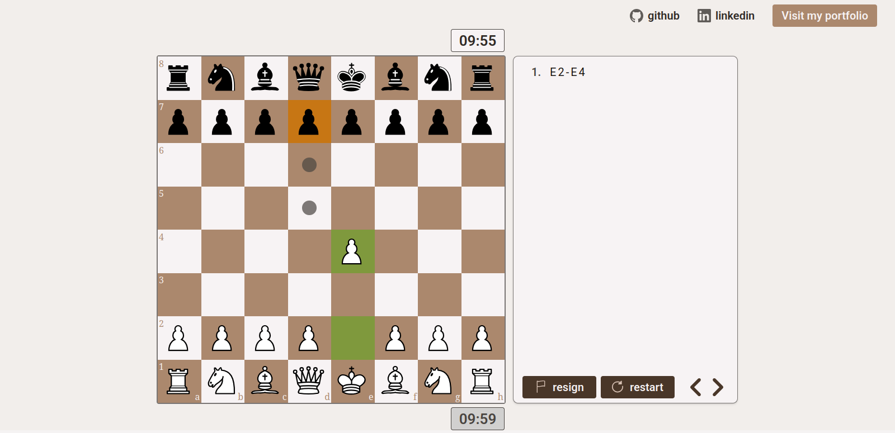

# React Chess

Two player chess made entirely in react. Made with modern looks and good user experience in mind.

# Demo

# Features

- Play chess: Two player mode with all standard rules
- Modern design: Clean and intuitive, focused on good user experience
- Move history: Undo/redo mechanics, making it easy to alter - or just rewatch the game move by move
- Respnosive: Enjoy chess on any device

# Installation

<!-- start:code block -->
## Clone this repository
git clone https://github.com/PiratiSaKaribika/React-Chess.git

## Install dependencies
cd React-Chess
npm install

## Run the app
npm run dev
<!-- end:code block -->
